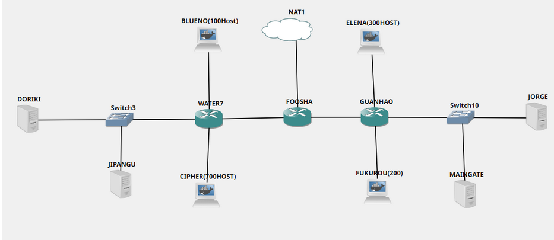
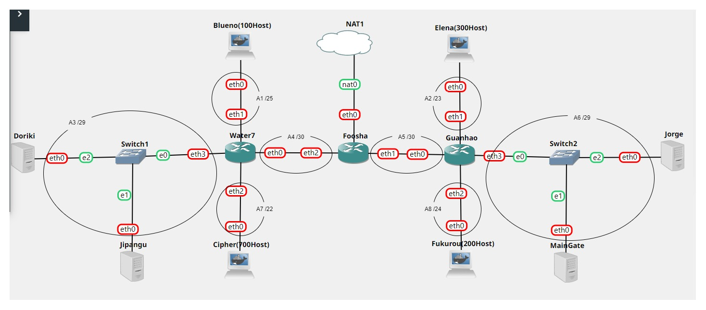
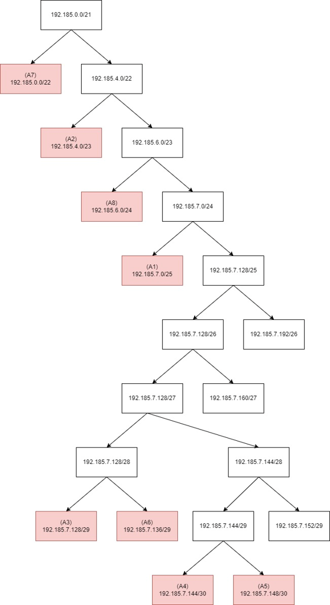

# Jarkom-Modul-5-C03-2021

Repository Praktikum Jaringan Komputer Modul 5 Jaringan Komputer

.  
Junaedi Akbar <br>
(05111940000041)
<br>
Zydhan Linnar Putra
<br>
(05111940000118)
<br>
M.Fajri Davyza Chaniago
<br>
(05111940000180)  
.

# Praktikum Modul 5

### 📅 5 - 7 Desember 2021

### (A) Tugas pertama kalian yaitu membuat topologi jaringan sesuai dengan rancangan yang diberikan Luffy seperti dibawah ini:



### (B) Konfigurasi IP dengan VLSM (Variable Length Subnet Masking) :



### Tree :



### Pembagian IP :

| Subnet        |   Jumlah IP   |       Netmask |   subnetmask    |      nid      |
| :------------ | :-----------: | ------------: | :-------------: | :-----------: |
| ------------- | ------------- | ------------- |  -------------  | ------------- |
| A1            |       2       |           /25 | 255.255.255.128 |  192.185.7.0  |
| A2            |      301      |           /23 |  255.255.254.0  |  192.185.0.4  |
| A3            |       4       |           /29 | 255.255.255.248 | 192.185.7.128 |
| A4            |      101      |           /30 | 255.255.255.252 | 192.185.7.144 |
| A5            |      101      |           /30 | 255.255.255.252 | 192.185.7.148 |
| A6            |       4       |           /29 | 255.255.255.248 | 192.185.7.136 |
| A7            |      701      |           /22 |  255.255.252.0  |  192.185.0.0  |
| A8            |      201      |           /24 |  255.255.255.0  |  192.185.6.0  |
| Jumlah        |     1316      |           /21 |  255.255.248.0  |       -       |

- SETTING INTERFACE PADA GNS3

**Foosha**

```
auto eth0
iface eth0 inet static
      address 192.168.122.11
      netmask 255.255.255.0
      gateway 192.168.122.1
      up echo nameserver 192.185.7.130 > /etc/resolv.conf

auto eth1
iface eth1 inet static
      address 192.185.7.149
      netmask 255.255.255.252

auto eth2
iface eth2 inet static
      address 192.185.7.145
      netmask 255.255.255.252

```

**Water7**

```
auto eth0
iface eth0 inet static
      address 192.185.7.146
      netmask 255.255.255.252
      gateway 192.185.7.145
      up echo nameserver 192.185.7.130 > /etc/resolv.conf

auto eth1
iface eth1 inet static
      address 192.185.7.1
      netmask 255.255.255.128

auto eth2
iface eth2 inet static
      address 192.185.7.129
      netmask 255.255.255.248

auto eth3
iface eth3 inet static
      address 192.185.0.1
      netmask 255.255.252.0

```

**GUANHAO**

```
auto eth0
iface eth0 inet static
	address 192.185.7.150
	netmask 255.255.255.252
	gateway 192.185.7.149
	up echo nameserver 192.185.7.130 > /etc/resolv.conf

auto eth1
iface eth1 inet static
	address 192.185.7.137
	netmask 255.255.255.248

auto eth2
iface eth2 inet static
	address 192.185.4.1
	netmask 255.255.254.0

auto eth3
iface eth3 inet static
	address 192.185.6.1
	netmask 255.255.255.0
```

**Blueno**

```
auto eth0
iface eth0 inet dhcp
```

**Chiper**

```
auto eth0
iface eth0 inet dhcp
```

**Elena**

```
auto eth0
iface eth0 inet dhcp
```

**fukurou**

```
auto eth0
iface eth0 inet dhcp

```

**MainGate**

```
# Static config for eth0
auto eth0
iface eth0 inet static
	address 192.185.7.139
	netmask 255.255.255.248
	gateway 192.185.7.137
	up echo nameserver 192.185.7.130 > /etc/resolv.conf

```

**Jorge**

```
# Static config for eth0
auto eth0
iface eth0 inet static
	address 192.185.7.138
	netmask 255.255.255.248
	gateway 192.185.7.137
	up echo nameserver 192.185.7.130 > /etc/resolv.conf

```

**Doriki**

```
# Static config for eth0
auto eth0
iface eth0 inet static
      address 192.185.7.130
      netmask 255.255.255.248
      gateway 192.185.7.129
      up echo nameserver 192.168.122.1 > /etc/resolv.conf
```

**Jipangu**

```
# Static config for eth0
auto eth0
iface eth0 inet static
      address 192.185.7.131
      netmask 255.255.255.248
      gateway 192.185.7.129
      up echo nameserver 192.185.7.130 > /etc/resolv.conf
```

### (C) Routing

**Foosha**

```
# Lewat eth2
route add -net 192.185.7.128 netmask 255.255.255.248 gw 192.185.7.146   # A3
route add -net 192.185.7.0 netmask 255.255.255.128 gw 192.185.7.146   # A1
route add -net 192.185.0.0 netmask 255.255.252.0 gw 192.185.7.146   # A7

# Lewat eth1
route add -net 192.185.4.0 netmask 255.255.254.0 gw 192.185.7.150   # A2
route add -net 192.185.7.136 netmask 255.255.255.248 gw 192.185.7.150   # A6
route add -net 192.185.6.0 netmask 255.255.255.0 gw 192.185.7.150   # A8
```

### (D) Tugas berikutnya adalah memberikan ip pada subnet Blueno, Cipher, Fukurou, dan Elena secara dinamis menggunakan bantuan DHCP server. Kemudian kalian ingat bahwa kalian harus setting DHCP Relay pada router yang menghubungkannya.

cara:
Karena Sebelumnya kita telah memberikan IP dhcp kepada Blueno, Cipher, Fukurou, dan Elena :

```
auto eth0
iface eth0 inet dhcp
```

Pada foosha disetting sebagai dhcp relay

**Foosha**

```
apt-get update
apt-get install isc-dhcp-relay -y

# Setting Interface & Server
echo "SERVERS=\"192.185.7.131\"
INTERFACES=\"eth0 eth1 eth2 eth3\"
OPTIONS=
" > /etc/default/isc-dhcp-relay

```

**Water 7**

```
apt-get update
apt-get install isc-dhcp-relay -y

# Setting Interface & Server
echo "SERVERS=\"192.185.7.131\"
INTERFACES=\"eth0 eth1 eth2 eth3\"
OPTIONS=
" > /etc/default/isc-dhcp-relay

# Start DHCP Relay
service isc-dhcp-relay restart

```

**Guanhao**

```

apt-get update
apt-get install isc-dhcp-relay -y

# Setting Interface & Server

echo "SERVERS=\"192.185.7.131\"
INTERFACES=\"eth0 eth1 eth2 eth3\"
OPTIONS=
" > /etc/default/isc-dhcp-relay

# Start DHCP Relay

service isc-dhcp-relay restart

```

### (1) Agar topologi yang kalian buat dapat mengakses keluar, kalian diminta untuk mengkonfigurasi Foosha menggunakan iptables, tetapi Luffy tidak ingin menggunakan MASQUERADE.

Disini IP Foosha sudah diubah menjadi `192.168.122.1` (static) sehingga iptables-nya disetel ke IP tersebut.

```bash
# IP Foosha static 192.168.122.11
iptables -t nat -A POSTROUTING -o eth0 -s 192.185.0.0/21 -j SNAT --to-source 192.168.122.11
```

### (2) Kalian diminta untuk mendrop semua akses HTTP dari luar Topologi kalian pada server yang memiliki ip DHCP dan DNS Server demi menjaga keamanan.

Untuk memblokir cukup melakukan negasi IP topologi dan mengarah ke subnet dari Jipangu dan Doriki:

```bash
# Blokir HTTP request ke DNS & DHCP dari luar subnet
iptables -A INPUT ! -s 192.185.0.0/21 -d 192.185.7.128/29 -p tcp --dport 80 -j DROP
```

### (3) Karena kelompok kalian maksimal terdiri dari 3 orang. Luffy meminta kalian untuk membatasi DHCP dan DNS Server hanya boleh menerima maksimal 3 koneksi ICMP secara bersamaan menggunakan iptables, selebihnya didrop.

Menggunakan modul `connlimit` kita dapat melakukan reject pada koneksi yang berjumlah > 3. Script ini dijalankan pada Jipangu dan Doriki:

```bash
iptables -A INPUT -p icmp -m connlimit --connlimit-above 3 --connlimit-mask 0 -j REJECT
```

### (4) Kemudian kalian diminta untuk membatasi akses ke Doriki yang berasal dari subnet Blueno, Cipher, Elena dan Fukuro dengan beraturan sebagai berikut :Akses dari subnet Blueno dan Cipher hanya diperbolehkan pada pukul 07.00 - 15.00 pada hari Senin sampai Kamis.

Menggunakan modul `time` kita dapat melakukan accept pada koneksi yang berjalan pada waktu yang diperbolehkan, sisanya direject. Script ini dijalankan pada Jipangu dan Doriki:

```bash
iptables -A INPUT -s 192.185.7.0/25 -m time --timestart 07:00 --timestop 15:00 --weekdays Mon,Tue,Wed,Thu -j ACCEPT
iptables -A INPUT -s 192.185.7.0/25 -j REJECT

iptables -A INPUT -s 192.185.0.0/22 -m time --timestart 07:00 --timestop 15:00 --weekdays Mon,Tue,Wed,Thu -j ACCEPT
iptables -A INPUT -s 192.185.0.0/22 -j REJECT
```

### (5) Akses dari subnet Elena dan Fukuro hanya diperbolehkan pada pukul 15.01 hingga pukul 06.59 setiap harinya.Selain itu di reject

Menggunakan modul `time` kita dapat melakukan accept pada koneksi yang berjalan pada waktu yang diperbolehkan, sisanya direject. Script ini dijalankan pada Jipangu dan Doriki:

```bash
iptables -A INPUT -s 192.185.4.0/23 -m time --timestart 15:01 --timestop 23:59 --weekdays Mon,Tue,Wed,Thu,Fri,Sat,Sun -j ACCEPT
iptables -A INPUT -s 192.185.4.0/23 -m time --timestart 00:00 --timestop 06:59 --weekdays Mon,Tue,Wed,Thu,Fri,Sat,Sun -j ACCEPT
iptables -A INPUT -s 192.185.4.0/23 -j REJECT

iptables -A INPUT -s 192.185.6.0/24 -m time --timestart 15:01 --timestop 23:59 --weekdays Mon,Tue,Wed,Thu,Fri,Sat,Sun -j ACCEPT
iptables -A INPUT -s 192.185.6.0/24 -m time --timestart 00:00 --timestop 06:59 --weekdays Mon,Tue,Wed,Thu,Fri,Sat,Sun -j ACCEPT
iptables -A INPUT -s 192.185.6.0/24 -j REJECT
```

Terdapat tricky case yaitu konfigurasi waktu yang melewati 2 hari. Oleh karena itu dipecah jamnya menjadi 15.01 - 23.59 dan 00.00 hingga 06.59.

### (6) Karena kita memiliki 2 Web Server, Luffy ingin Guanhao disetting sehingga setiap request dari client yang mengakses DNS Server akan didistribusikan secara bergantian pada Jorge dan Maingate

Membuat zone DNS baru pada `c03.com` dan set A record ke dua IP address.

```bash
# Buat zone
echo "zone \"c03.com\" {
        type master;
        file \"/etc/bind/jarkom/c03.com\";
};" > /etc/bind/named.conf.local

# Buat foldernya
mkdir /etc/bind/jarkom/

# Buat load balancing di domain utama
echo ";
; BIND data file for local loopback interface
;
\$TTL    604800
@       IN      SOA     c03.com. root.c03.com. (
                     2021120701         ; Serial
                         604800         ; Refresh
                          86400         ; Retry
                        2419200         ; Expire
                         604800 )       ; Negative Cache TTL
;
@       IN      NS      c03.com.
@       IN      A       192.185.7.138 ; IP Jorge
@       IN      A       192.185.7.139 ; IP Maingate
www     IN      CNAME   c03.com.
" > /etc/bind/jarkom/c03.com

# Restart bind9
service bind9 restart
```
